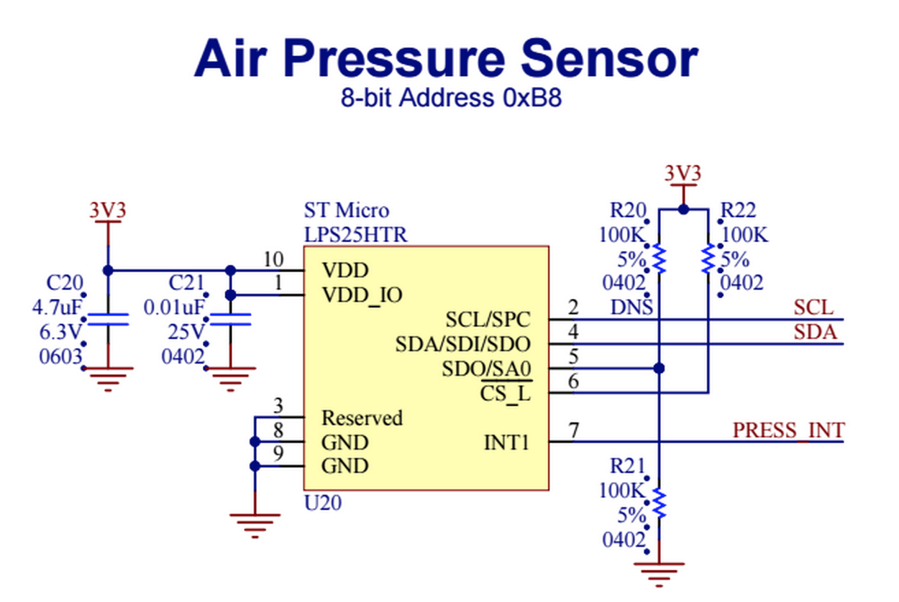

# Driver for the LPS25H Air Pressure / Temperature Sensor

Author: [Tom Byrne](https://github.com/ersatzavian/)

The [LPS25H](http://www.st.com/web/en/resource/technical/document/datasheet/DM00066332.pdf) is a MEMS absolute pressure sensor. This sensor features a large functional range (260-1260hPa) and internal averaging for improved precision.

The LPS25H can interface over I&sup2;C or SPI. This class addresses only I&sup2;C for the time being.

**To add this library to your project, add** `#require "LPS25H.class.nut:2.0.0"` **to the top of your device code**

## Hardware

To use the LPS25H, connect the I2C interface to any of the imp's I2C Interfaces. To see which pins can act as an I2C interface, see the [imp pin mux](https://electricimp.com/docs/hardware/imp/pinmux/) on the Electric Imp Developer Center.

The LPS25H Interrupt Pin behavior can be configured through this class. The corresponding pin on the imp and associated callback are not configured or managed through this class. To use the interrupt pin:

- Connect the LPS25H's "INT1" pin to an imp pin
- Configure the imp pin connected to INT1 as a DIGITAL_IN with your desired callback function
- Use the methods in this class to configure the interrupt behavior as needed



## Class Usage

### Constructor

The constructor takes two arguments to instantiate the class: a pre-config
ured I&sup2;C bus and the sensor’s I&sup2;C address. The I&sup2;C address is optional and defaults to 0xB8 (8-bit address).

```squirrel
const LPS25H_ADDR = 0xBA;    // non-default 8-bit I2C Address for LPS25H (SA0 pulled high)

hardware.i2c89.configure(CLOCK_SPEED_400_KHZ);
pressureSensor <- LPS25H(hardware.i2c89, LPS25H_ADDR);
```

### Reset

The LPS25H is not automatically reset when constructed so that Electric Imp applications can use the device through sleep/wake cycles without it losing state. To reset the device to a known state, call the *softReset* method:

```squirrel
hardware.i2c89.configure(CLOCK_SPEED_400_KHZ);
pressureSensor <- LPS25H(hardware.i2c89);
pressureSensor.softReset();
```

After a reset, the LPS25H will be disabled. Call *enable* to use the device.

### Class Methods


### enable(*state*)

Enable (*state* = true) or disable (*state* = false) the LPS25H. The device must be enabled before attempting to read the pressure or temperature.

```squirrel
pressureSensor.enable(true);    // Enable the sensor
```

### read(*callback*)

The **read()** method reads the pressure in hPa and executes the callback passed as its only parameter with the result. The callback takes a single parameter, a table. If an error occurs during the reading, the table passed to the callback will contain a key "err", with a description of the error, and the pressure reading will be null. If the pressure is read successfully, it will be stored in the table with the key "pressure".

If the callback is omitted, **read** executes synchronously and returns a table. As with the asynchrounous flow, the "err" key is present in the table if an error occurs. The pressure is stored with the "pressure" key.

```squirrel
pressureSensor.read(function(result) {
  if ("err" in result) {
    server.error("An Error Occurred: "+result.err);
  } else {
  	server.log(format("Current Pressure: %0.2f hPa", result.pressure));
  }
});
```

```squirrel
function hpaToHg(hpa) {
  return (1.0 * hpa) / 33.8638866667;
}

local result = pressureSensor.read();

if ("err" in result) {
  server.error("An Error Occurred: "+result.err);
} else {
  server.log(format("Current Pressure: %0.2f in. Hg", hpaToHg(result.pressure));
}
```

### getTemp()

Returns temperature in degrees Celsius.

```squirrel
server.log("Current Temperature: "+pressure.getTemp() + " C");
```

### setReferencePressure(*pressure*)

Set the reference pressure for differential pressure measurements and interrupts (see *configureInterrupt*). Reference Pressure is in hectopascals (hPa). Negative pressures are supported. Reference Pressure range is +/- 2046 hPa.

```squirrel
server.log("Internal Reference Pressure Offset = " + pressure.getReferencePressure());
```

### getReferencePressure()

Get the reference pressure for differential pressure measurements and interrupts (see *configureInterrupt*). Reference Pressure is in hectopascals (hPa).

```squirrel
server.log("Internal Reference Pressure Offset = " + pressure.getReferencePressure());
```

### configureInterrupt(*enable*, [*threshold*, *options*])

This method configures the interrupt pin driver, threshold, and sources.

- *enable* is a required boolean parameter. Set true to enable the interrupt pin.
- *threshold* is an optional parameter, to set the interrupt threshold pressure. Interrupts are generated on differential pressure events; a high differential pressure interrupt occurs if (Absolute Pressure - Reference Pressure) > Threshold, a low differential pressure interrupt occurs if (Absolute Pressure - Reference Pressure) < (-1.0 * Threshold). The threshold is expressed in hectopascals (hPa).
- *options* is an optional bitfield which allows the pin driver and interrupt condition to be configured by OR'ing together the appropriate flags:

| Constant | Description | Notes |
| -------- | ----------- | ----- |
| INT_ACTIVELOW | Interrupt pin active-high | Interrupt pin is active-high by default|
| INT_OPENDRAIN | Interrupt pin driver push-pull | Interrupt pin driver push-pull by default |
| INT_LATCH | Interrupts latched | Clear latched interrupts by calling getInterruptSrc() |
| INT_LOW_PRESSURE | Interrupt on pressure below threshold | |
| INT_HIGH_PRESSURE | Interrupt on pressure above threshold | |

```squirrel
// Enable interrupt, configure as push-pull, active-high, latched. Fire interrupt if (absolute pressure - reference pressure) > 10 hPa
pressureSensor.configureInterrupt(true, 10, LPS25H.INT_LATCH | LPS25H.INT_HIGH_PRESSURE);
```

```squirrel
// Enable interrupt, configure as open-drain, active-low, latched. Fire interrupt if (absolute pressure - reference pressure) < -20 hPa
pressureSensor.configureInterrupt(ture, 20, LPS25H.INT_ACTIVELOW | LPS25H.INT_OPENDRAIN | LPS25H.INT_LATCH | LPS25H.INT_LOW_PRESSURE);
```

### getInterruptSrc() 

Determine what caused an interrupt, and clear latched interrupt. This method returns a table with three keys to provide information about which interrupts are active.

| key | Description | Notes |
| -------- | ----------- | ----- |
| int_active | *true* if an interrupt is currently active or latched | |
| high_pressure | *true* if the active or latched interrupt was due to a high pressure event | |
| low_pressure | *true* if the active or latched interrupt was due to a low pressure event | |

```squirrel
// Check the interrupt source and clear the latched interrupt
local intSrc = pressureSensor.getInterruptSrc();
if (intSrc.int_active) {
  // interrupt is active
  if (intSrc.high_pressure) {
    server.log("High Pressure Interrupt Occurred!");
  } 
  if (intSrc.low_pressure) {
    server.log("Low Pressure Interrupt Occurred!");
  }
} else {
  server.log("No Interrupts Active");
}
```

### setPressNpts(*numberOfReadings*)

Set the number of readings taken and then internally averaged to produce a pressure result. The value provided will be rounded up to the nearest valid value: 8, 32 and 128. The actual value used is returned.

```squirrel
// Fastest readings, lowest precision
pressureSensor.setPressNpts(8);

// Slowest readings, highest precision
pressure
pressureSensor.setPressNpts(128);

// Rounding and checking result
local actualNpts = pressureSensor.setPressNpts(30);
server.log("Actual Pressure Npts = "+actualNpts); 
// prints "Actual Pressure Npts = 32"
```

### setTempNpts(*numberOfReadings*)

Set the number of readings taken and internally averaged to produce a temperature result. The value provided will be rounded up to the nearest valid value: 8, 16, 32 and 64. The actual value used is returned.

```squirrel
// Fastest readings, lowest precision
pressureSensor.setTempNpts(8);

// Slowest readings, highest precision
pressureSensor.setTempNpts(64);
```


### softReset()

Reset the LPS25H from software. Device will come up disabled.

```squirrel
pressureSensor.softReset();
```

## License

The LPS25H library is licensed under the [MIT License](./LICENSE).
